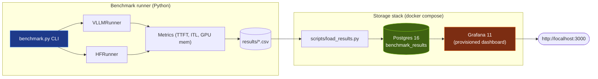

# LLM Inference Benchmarking Suite

Reproducible throughput, TTFT, and inter-token-latency measurements for **vLLM** and **HuggingFace Transformers** on quantized open-source models, running on a single consumer GPU. Postgres for storage, Grafana for visualization, Docker Compose for one-command bring-up.


## Headline findings

> Hardware: NVIDIA RTX 4060 Laptop, 8 GB VRAM, CUDA 12.7, vLLM 0.20.0, transformers 4.40+

| Finding | Number | What it means |
|---|---|---|
| **AWQ-Marlin vs generic AWQ kernel** (vLLM, Mistral-7B, batch=4, medium prompts) | **9.38× throughput** | Kernel choice within the same engine dominates everything else |
| **vLLM vs HF Transformers** (TinyLlama-1.1B fp16, batch=4, medium prompts) | **1.88× throughput** | Continuous batching + paged attention beat the naive baseline |
| **Best throughput observed** (vLLM, TinyLlama, batch=4, medium prompts) | **368 tok/s** | Small model + good engine still beats big model + better kernel |
| **TTFT scaling** (vLLM, Marlin, prompt 24 → 118 tokens) | **301 ms → 647 ms** | Prefill is compute-bound and ~linear in input length |
| **TTFT vs batch size** (vLLM, Marlin, medium prompts) | **647 ms → 658 ms** (b=1 → b=4) | PagedAttention parallelizes prefill across the batch |
| **ITL drop with batch size** (vLLM, Marlin, medium prompts) | **14.3 ms → 3.6 ms/token** (b=1 → b=4) | Decode is memory-bandwidth-bound and amortizes across batch |

These are not abstract claims. Every number above is a row in the dashboard, recorded under a known kernel, quantization, and library version.

## Quickstart

```bash
# 0. clone and enter
git clone https://github.com/danish7x7/llm-inference-bench.git
cd llm-inference-bench

# 1. bring up Postgres + Grafana
docker compose up -d

# 2. ingest the included sample results
pip install psycopg2-binary
python scripts/load_results.py --truncate

# 3. open the dashboard
# → http://localhost:3000  (anonymous viewer; admin/admin to edit)
```

That's it. The sample results in `results/` were captured on the hardware above and are populated into the dashboard automatically. To run benchmarks of your own (requires CUDA + vLLM):

```bash
# vLLM smoke test on TinyLlama (1.1B, fp16, no GPU memory pressure)
python scripts/smoke_test.py --runner vllm

# Real benchmark sweep
python benchmark.py --model mistral-7b --runner vllm \
                    --prompts short medium long \
                    --batch-sizes 1 2 4
```

CSVs land in `results/` with all 25 schema-v2 columns including the kernel, quantization, dtype, and library versions used. Re-run `load_results.py` to ingest the new rows.

## What this project is built to demonstrate

This is a portfolio piece for inference-engineering roles. The four engineering claims I want it to support:

1. **End-to-end benchmarking framework** - pluggable `InferenceRunner` interface, two implementations (vLLM and HF), CLI for sweep matrices, schema-versioned CSV output, Postgres ingestion.
2. **Quantified kernel and engine effects separately** - by holding model and quantization fixed and only varying the kernel (`awq` vs `awq_marlin`), I can attribute the 9.38× speedup to the kernel choice alone, distinct from the 1.88× engine speedup measured against HF.
3. **Production-shaped infrastructure** - service-oriented stack (Postgres, Grafana), automated provisioning (no UI clicks), Docker Compose, anonymous read-only Grafana access for sharing.
4. **Honest measurement methodology** - TTFT and ITL come from different sources for different runners; this is documented in `docs/prefill_vs_decode.md` rather than papered over.

## Architecture



**Why the layers:** the `InferenceRunner` abstraction means swapping in another backend (SGLang, TensorRT-LLM, …) is a matter of one new file implementing `load() / run() / unload()`. The CSV-then-Postgres flow means benchmarks can run on a GPU machine without any DB infrastructure, and the database can be populated from any number of remote runs by `scp`-ing CSVs.

## Notable engineering decisions

### vLLM was not using the optimized AWQ kernel by default

The first Mistral-7B benchmark produced ~7 tok/s - the model was running, but the throughput was nonsensically low. The diagnostic was buried in the vLLM startup logs:

```
Detected that the model can run with awq_marlin, however you specified
quantization=awq explicitly, so forcing awq. Use quantization=awq_marlin
for faster inference
```

vLLM's generic AWQ kernel does not use the Marlin optimized layout for Ada/Ampere tensor cores. Switching `quantization="awq_marlin"` in the model registry produced a **9.38× speedup with zero other changes**. Both CSVs are kept in `results/` (`vllm_mistral-7b_awq_generic.csv` and `vllm_mistral-7b_awq_marlin.csv`) so the comparison is reproducible from this repo. See `docs/prefill_vs_decode.md` for the full discussion.

### HF's TextIteratorStreamer cannot batch

HuggingFace's per-token streamer fundamentally only supports `batch_size=1`. The benchmark needed real per-token timing at batch=1 *and* honest TTFT measurement at batch>1 - these have different right answers. The runner now dispatches:

- `batch_size == 1` → `TextIteratorStreamer`, true per-token timing
- `batch_size > 1`  → two-phase generate: a `max_new_tokens=1` probe to measure pure prefill latency, then full generation; ITL is averaged across the decode portion. The `notes` column on the result tags this as `ttft_quality=two_phase`.

### Schema versioning

Every benchmark row records the kernel, quantization, dtype, max_model_len, and the `vllm`/`transformers`/`torch` versions used. `schema_version` is on every row. This means a row from today and a row from six months and three vLLM upgrades later remain comparable in the same database, and a reviewer can see exactly what was running. The 30 sample rows shipped in this repo are tagged `2-backfill` (upgraded from the v1 schema by `scripts/backfill_csv_schema.py`).

### Known limitations (called out, not hidden)

- **VRAM column reflects vLLM's pre-allocated KV pool, not active usage.** vLLM reserves its KV cache pool at engine startup based on `gpu_memory_utilization`; `pynvml` reads this as "used" regardless of how many tokens are actually live. Honest fix would be reading vLLM's own KV-cache utilization metric or computing analytically from token count × dtype × layers. Documented but not yet implemented.
- **HF batch>1 ITL p90/p99 collapse to the mean.** The two-phase path averages across the decode window - accurate aggregate, no distribution. By design.
- **TTFT measurement methodology differs across backends.** vLLM uses `RequestMetrics.first_token_time`; HF batch=1 uses streamer first-yield; HF batch>1 uses the prefill-only probe. Not directly comparable across runners as a percentile, but each within-runner comparison is honest.

## File map

```
.
├── benchmark.py                 # CLI entry point, model registry, schema v2 CSV writer
├── docker-compose.yml           # Postgres + Grafana
├── postgres/init.sql            # benchmark_results table + indexes + v_latest_results view
├── grafana/provisioning/        # auto-wired datasource and dashboard (no UI clicks)
├── src/
│   ├── runners/
│   │   ├── base.py              # InferenceRunner interface + GenerationConfig + RunResult
│   │   ├── vllm_runner.py       # vLLM with chat template, RequestMetrics, Marlin kernel
│   │   └── hf_runner.py         # HF with two-path dispatch, AWQ pre-quantization detection
│   ├── metrics.py               # TTFT, ITL, throughput, GPU memory (pynvml + torch fallback)
│   └── storage.py               # Postgres ingestion (psycopg2 bulk insert with type coercion)
├── prompts/                     # short/medium/long prompt sets
├── scripts/
│   ├── smoke_test.py            # quick sanity check on TinyLlama
│   ├── backfill_csv_schema.py   # one-shot v1 → v2 CSV upgrade
│   └── load_results.py          # CLI: ingest results/*.csv to Postgres
├── results/                     # benchmark CSVs (kept in repo for the included samples)
└── docs/
    ├── dashboard.png            # screenshot used in this README
    └── prefill_vs_decode.md     # technical writeup: prefill bound, decode bound, kernel impact
```

## Reproducing the headline numbers

```bash
# Prerequisites: NVIDIA GPU with CUDA 12.7+, vLLM 0.20.0, autoawq, ~6 GB free VRAM.
# (Pre-built environment notes in CHANGELOG.md.)

# Marlin kernel: 9× speedup story
python benchmark.py --model mistral-7b --runner vllm \
                    --prompts short medium long --batch-sizes 1 2 4
# CSV will be tagged kernel=awq_marlin in the schema.

# Engine comparison: vLLM ~2× HF on TinyLlama
python benchmark.py --model tinyllama --runner vllm \
                    --prompts short medium --batch-sizes 1 2 4
python benchmark.py --model tinyllama --runner hf \
                    --prompts short medium --batch-sizes 1 2 4

# Ingest into Postgres (Grafana auto-refreshes every 30 s)
python scripts/load_results.py
```

## License

MIT.

---

*Built as a focused study in modern LLM inference performance. The interesting story is not what is expected as "Engine A vs Engine B" but how dramatically a single kernel-config string can change the answer.*