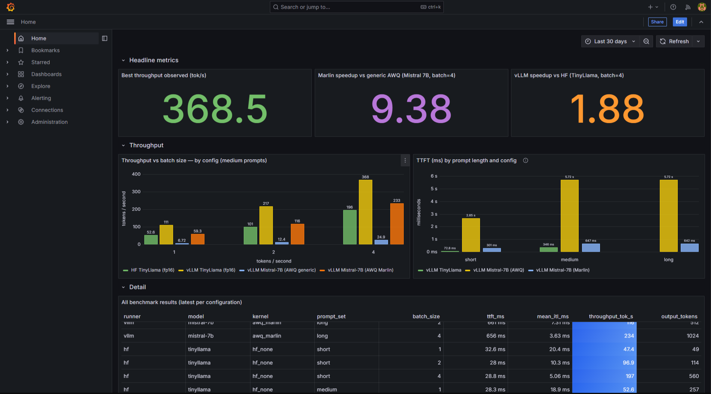
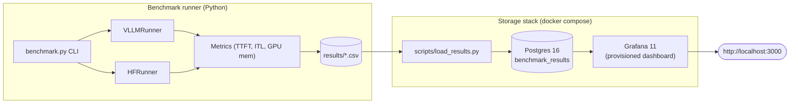

# LLM Inference Benchmarking Suite



## What it is

A benchmarking harness for LLM inference on consumer GPU hardware. It measures the four numbers that actually decide whether a serving setup is viable — **time-to-first-token (TTFT), inter-token latency (ITL, with p90/p99), throughput, and VRAM** — across two backends, **vLLM** and **HuggingFace Transformers**, behind a single pluggable `InferenceRunner` interface. Every run is written to a **versioned, reproducible CSV schema** (kernel, quantization, dtype, `max_model_len`, and the `vllm`/`transformers`/`torch` versions are on every row), and results flow into a **Postgres + Grafana** stack via `docker compose` for storage and visualization.

## Why it exists

The goal is to understand the internals of production inference systems by building against them on real hardware — KV cache, paged attention, continuous batching, quantization kernels — rather than reading about them. That means the methodology has to be honest, because the methodology is the point: distinct prompts so prefix caching doesn't silently inflate the numbers, a discarded warmup run per config so first-call JIT/graph-capture costs don't leak into the measurement, and version columns so a row from today stays comparable across vLLM upgrades. The interesting results in this repo came from getting those choices right — and from catching where I'd gotten one wrong.

## What was learned

### Getting vLLM to initialize at all under WSL2

The hardest part wasn't measuring inference — it was getting the engine to start on a laptop 4060 under WSL2. Three failures, each tracing to a specific step in how vLLM brings up its engine:

**Stale driver.** torch and vLLM here are CUDA-13 pip builds, but the machine shipped with driver `566.24` / CUDA 12.7. CUDA is forward-compatible at the driver level only up to a point; a CUDA-13 runtime needs a driver that advertises 13.x. The symptom was torch failing to see the GPU at all. Fix: update the NVIDIA driver on the Windows side (WSL inherits it) to a CUDA-13-capable release. torch + vLLM are pinned to each other for exactly this reason — bumping torch independently re-breaks the CUDA contract.

**`UVA is not available`.** With the driver fixed, vLLM's newer **V2 model runner** crashed during engine init. The V2 runner assumes Unified Virtual Addressing — a single address space shared across host and device — to manage its KV/tensor allocations. WSL's GPU paravirtualization doesn't expose UVA, so init aborts. Forcing the V1 runner (`VLLM_USE_V2_MODEL_RUNNER=0`) sidesteps it with no functional loss on a single GPU.

**`Could not find nvcc`.** Next, the **FlashInfer sampler** failed. vLLM can route top-p/top-k sampling through a FlashInfer kernel that is **JIT-compiled at first use**, which needs `nvcc`. This box has only the pip CUDA *runtime* libraries — no system toolkit, no compiler — so the JIT can't build. Disabling it (`VLLM_USE_FLASHINFER_SAMPLER=0`) falls back to native PyTorch sampling, which is correct and fast enough for single-GPU. (A related JIT path, `deep_gemm`, fails its import with `AssertionError` on `cuda_home is None` and falls back gracefully — harmless, ignore it.)

Both env vars now live as `os.environ.setdefault(...)` at the top of `src/runners/vllm_runner.py`, set before any `import vllm`, so the workarounds travel with the code instead of living in a shell profile. Verified by running with both unset from the environment: clean startup, no nvcc/UVA errors. The startup log line `FlashInfer top-p/top-k sampling disabled via VLLM_USE_FLASHINFER_SAMPLER=0` confirms the env var is reaching the engine.

The transferable lesson: most of vLLM's "it won't start" failures under WSL are about **what the engine tries to JIT-compile or memory-map at init**, not about the model. Read the startup log top to bottom before touching the model registry.

### Batch-size scaling — and the prefix-caching artifact I had to catch

A batch sweep on TinyLlama-1.1B (fp16) gives the textbook shape: throughput climbs with batch as each forward pass amortizes its fixed cost (kernel launches, weight reads from HBM) across more sequences, while TTFT rises because more requests share each prefill pass. Concretely, on distinct prompts:

| Batch | Throughput (tok/s) | TTFT (ms) | Mean ITL (ms) | vs batch 1 |
|------:|-------------------:|----------:|--------------:|-----------:|
| 1     | 100.3              | 72        | 8.5           | 1.0×       |
| 4     | 267.1              | 191       | 3.2           | 2.66×      |
| 8     | 413.9              | 194       | 2.0           | 4.13×      |
| 16    | 606.3              | 359       | 1.4           | **6.04×**  |

The interesting part is what almost went unnoticed. My **first** sweep used a 4-prompt set, so at batch 8 and 16 the prompts repeated — and with vLLM's prefix caching on, the repeated prefixes shared KV cache and skipped recomputation. That run reported **9.7× at batch 16**. It looked great and it was wrong: I was measuring prefix-cache hit rate, not batching scaling. Re-running with **16 distinct prompts** (no two sharing a prefix) collapsed the number to **6.0×** — prefix caching had been responsible for roughly **60% of the apparent gain** at batch 16.

The distinct-prompt run also exposed a TTFT wall the cached run had hidden: TTFT held a ~190 ms plateau through batch 8, then **jumped to 359 ms at batch 16**. That's **prefill saturation** — prefill is compute-bound, and once the combined prefill work of 16 unique prompts exceeds what one pass can overlap, the prefills serialize against the tensor cores and every request's first-token wait climbs. The cached run never hit it because there was barely any prefill to do. (Full writeups: [`docs/batch-sweep.md`](docs/batch-sweep.md), [`docs/batch-sweep-v2.md`](docs/batch-sweep-v2.md).)

### One config string was worth 9× — *(re-verified ~10× on vLLM 0.23.0, 2026-06-26)*

On the earlier 0.20.0 stack, a Mistral-7B run produced ~7 tok/s — the model loaded, but throughput was nonsensical. The diagnostic was one line in the vLLM startup log:

```
Detected that the model can run with awq_marlin, however you specified
quantization=awq explicitly, so forcing awq. Use quantization=awq_marlin
for faster inference
```

vLLM's generic AWQ kernel dequantizes 4-bit weights to fp16 in registers and runs a standard GEMM; the **Marlin** kernel fuses dequant into a tensor-core-friendly INT4×FP16 matmul. Switching `quantization="awq_marlin"` — a one-string change — delivered a ~9–10× throughput jump with nothing else touched. It's the most dramatic result in the project, and it isn't algorithmic; it's a configuration default.

**Re-verified on the current stack (vLLM 0.23.0, 2026-06-26).** A same-session A/B on Mistral-7B (16 distinct short prompts) gives generic AWQ **6.0 tok/s vs Marlin 62.8 tok/s** at batch 1 (**10.5×**) and **34.0 vs 337.1** at batch 8 (**9.9×**) — ~10× consistent across throughput, TTFT, and ITL at both batch sizes, matching the original 9.38× (batch 4, medium) measured on 0.20.0. The A/B is clean: with `quantization=awq` set explicitly, vLLM logged *"you specified quantization=awq explicitly, so forcing awq"* and ran the generic kernel — no silent Marlin upgrade — while the Marlin side logged `Using MarlinLinearKernel`. The `mistral-7b-awq` registry entry is the generic-AWQ side, kept so the comparison reproduces.

There's a second-order effect beyond raw speed. On the same 8 GB budget the Marlin run carried a **larger KV pool — 11,376 tokens / 5.55× max concurrency vs the generic kernel's 9,216 / 4.50×** (~20% more batching headroom). The 4-bit weights are identical (3.88 GiB both); the difference is CUDA-graph workspace (0.62 vs 0.74 GiB), which Marlin's tighter kernels capture into less of, leaving more VRAM for the KV cache. So kernel choice is a **concurrency** decision as much as a throughput one. Mechanism and the original 0.20.0 CSVs are in [`docs/prefill_vs_decode.md`](docs/prefill_vs_decode.md).

## Experiments

| Writeup | Stack | Finding |
|---|---|---|
| [`docs/batch-sweep-v2.md`](docs/batch-sweep-v2.md) | vLLM 0.23.0 | True batch scaling on distinct prompts: **6.0× throughput** batch 1→16; TTFT saturates at batch 16 (359 ms). |
| [`docs/batch-sweep.md`](docs/batch-sweep.md) | vLLM 0.23.0 | Original 4-prompt sweep; reported 9.7× — later shown to be **~60% prefix-cache inflation** at batch 16. |
| [`docs/prefill_vs_decode.md`](docs/prefill_vs_decode.md) | vLLM 0.20.0 (Marlin re-verified on 0.23.0) | Prefill is compute-bound, decode is memory-bound; the **AWQ-Marlin ~10×** kernel discovery (9.38× orig, ~10× re-verified) and a vLLM-vs-HF **1.88×** engine comparison. |

## Hardware / reproducibility

- **GPU:** NVIDIA RTX 4060 Laptop, **8 GB VRAM** — the binding constraint on everything (7–8B models only fit at 4-bit; `max_model_len` capped at 2048).
- **OS:** WSL2 (Ubuntu) on Windows. Expected, not bugs: vLLM forces `spawn` multiprocessing, `pin_memory=False`, NVML not fork-compatible.
- **Stack:** vLLM **0.23.0**, torch **2.11.0** (CUDA-13 pip build), Python **3.13**, FlashAttention 2 backend, V1 model runner. torch and vLLM versions are pinned to each other — do not bump torch alone.

Smoke test (verifies the full harness end-to-end and writes a CSV):

```bash
python benchmark.py --model tinyllama --runner vllm --prompts short
```

Batch sweep:

```bash
python benchmark.py --model tinyllama --runner vllm --prompts short --batch-sizes 1 2 4 8 16
```

Results land in `results/<runner>_<model>_<timestamp>.csv` with all schema-v2 columns. The WSL env-var workarounds are applied automatically from `vllm_runner.py`; no shell setup required.

### Storage + dashboard

The Postgres + Grafana stack is optional and brought up with one command:

```bash
docker compose up -d                       # Postgres 16 + Grafana 11 (provisioned)
pip install psycopg2-binary
python scripts/load_results.py --truncate   # ingest results/*.csv
# → http://localhost:3000  (anonymous viewer; admin/admin to edit)
```

`schema_version` is on every row, so rows from different vLLM versions remain comparable in the same database. The datasource and dashboard are provisioned from `grafana/provisioning/` — no UI clicks.

## Architecture



**Why the layers:** the `InferenceRunner` abstraction (`load() / run() / unload()`) means adding a backend — SGLang, TensorRT-LLM — is one new file. The CSV-then-Postgres flow means benchmarks run on a GPU box with no DB infrastructure, and the database can be populated from any number of remote runs by copying CSVs.

## File map

```
.
├── benchmark.py                 # CLI entry, model registry, schema-v2 CSV writer
├── docker-compose.yml           # Postgres + Grafana
├── postgres/init.sql            # benchmark_results table + indexes + view
├── grafana/provisioning/        # auto-wired datasource + dashboard
├── src/
│   ├── runners/
│   │   ├── base.py              # InferenceRunner interface + GenerationConfig + RunResult
│   │   ├── vllm_runner.py       # vLLM backend; WSL env workarounds; chat template; RequestMetrics
│   │   └── hf_runner.py         # HF backend; two-path dispatch for batched TTFT
│   ├── metrics.py               # TTFT, ITL, throughput, GPU memory
│   └── storage.py               # Postgres ingestion
├── prompts/                     # short/medium/long prompt sets
├── scripts/                     # smoke_test.py, load_results.py, backfill_csv_schema.py
├── results/                     # benchmark CSVs (sample rows kept in repo)
└── docs/                        # experiment writeups + dashboard.png
```

## What's next

- **gpu-memory-utilization sweep** — how effective KV-cache size and max concurrency scale with `gpu_memory_utilization` (vLLM logs both at startup). The clearest single-GPU view of the memory-vs-concurrency tradeoff.
- **fp16 vs AWQ quantization comparison** on a model where both fit — latency, throughput, VRAM in one table.
- **A vLLM contribution.** The endgame for this project is upstreaming something small and real — a doc fix for the WSL/UVA/nvcc init failures above, or a scheduler/metrics improvement found while profiling here.

## License

MIT.
